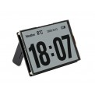
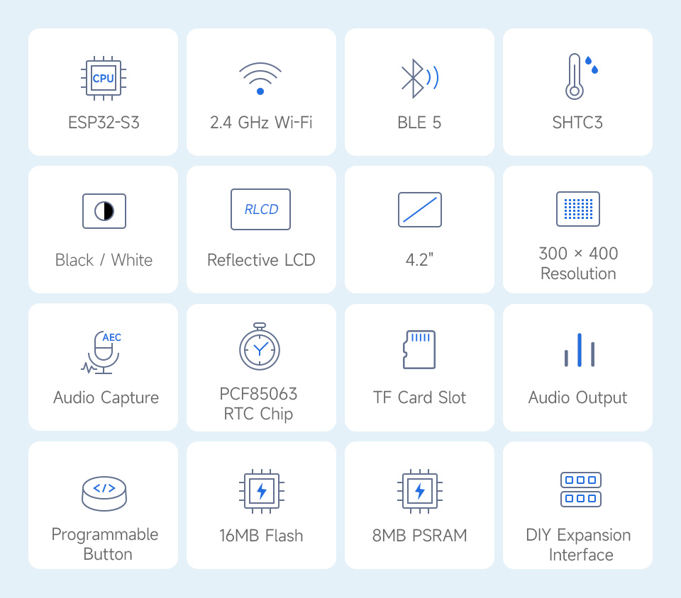
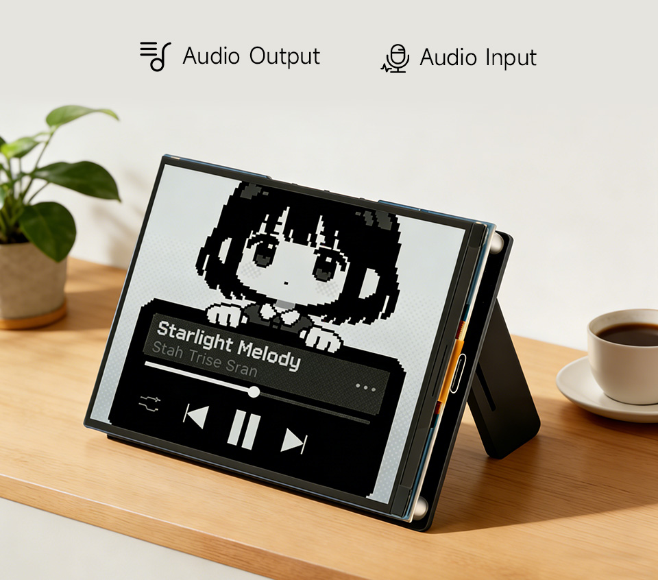
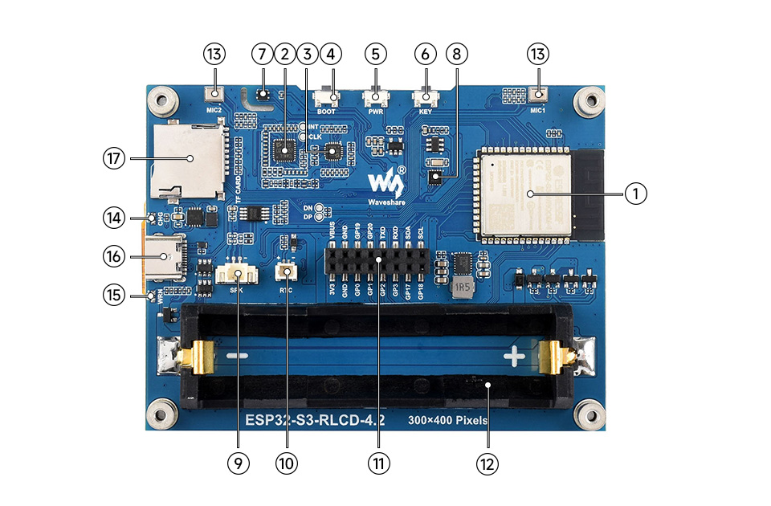
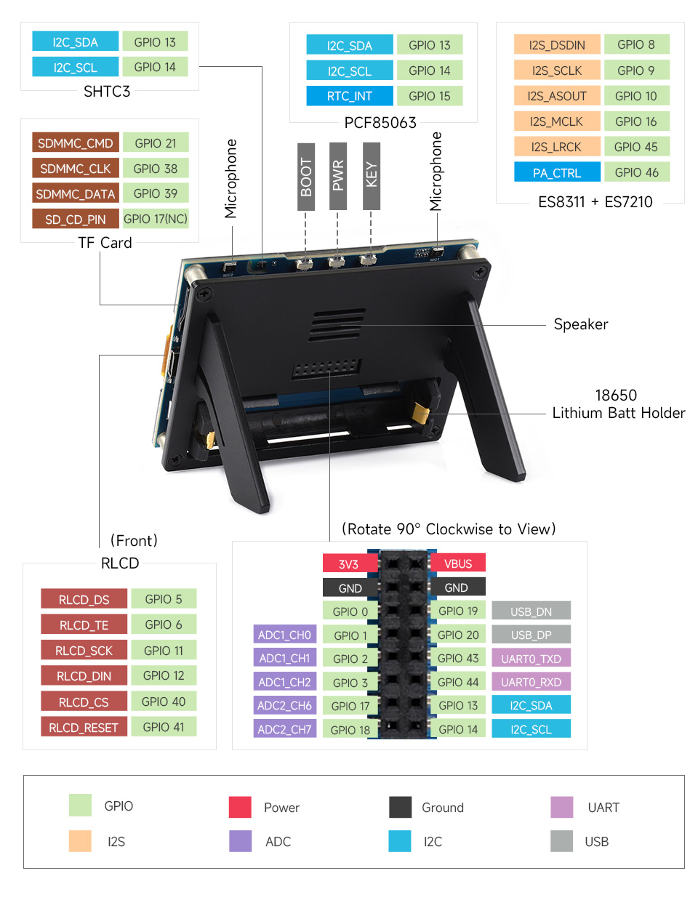

# RLCD-Esp32 — ESP32-S3 RLCD 4.2" Development Board

A product-style overview for the ESP32-S3 RLCD 4.2" platform (reflective “paper-like” display, Wi-Fi/BLE, audio, sensors).  
This README is hardware-focused and does not describe source code structure.

---

## Product Overview

ESP32-S3 RLCD 4.2" is a compact development board combining an ESP32-S3 module with a 4.2-inch reflective LCD (RLCD).  
The reflective panel is designed for comfortable reading under ambient light and does not require a backlight, making it suitable for low-power information displays.

---

## Highlights

- Xtensa 32-bit LX7 dual-core MCU, up to 240MHz
- 2.4GHz Wi-Fi + Bluetooth 5 (LE), onboard antenna
- 512KB SRAM + 384KB ROM, integrated 16MB Flash + 8MB PSRAM
- 4.2" RLCD (reflective, no backlight), 300 × 400, 2 gray levels (B/W), SPI, ST7305
- Dual-microphone array for voice algorithms (noise reduction, echo cancellation) and near-field / far-field wake-up use cases
- Onboard PCF85063 RTC + SHTC3 temperature & humidity sensor
- 18650 Li battery holder + RTC backup battery header (supports rechargeable RTC battery; main-battery mode or RTC independent power mode)
- TF (microSD) slot for external image/file storage
- Programmable KEY and BOOT side buttons for custom functions
- Reserved 2 × 8PIN, 2.54mm pitch female header for easy external expansion

---

## Features

### Display

- Type: Reflective LCD (RLCD)
- Size: 4.2"
- Resolution: 300 × 400
- Grey scale: 2 (black/white)
- Display mode: Reflective (no backlight required)
- Interface: SPI
- Driver IC: ST7305
- Display color: Black, White
- Best for: Text, icons, simple dashboards, always-on info panels

### Core System

- MCU: Xtensa 32-bit LX7 dual-core, up to 240MHz
- Wireless: 2.4GHz Wi-Fi + Bluetooth 5 (LE), onboard antenna
- Memory: 512KB SRAM, 384KB ROM, integrated 16MB Flash + 8MB PSRAM

### Audio (AI Voice)

- Dual-microphone array
- Supports audio algorithms such as noise reduction and echo cancellation
- Suitable for accurate voice recognition and near-field / far-field voice wake-up applications

### Sensors & Time

- PCF85063 RTC for accurate timekeeping
- SHTC3 temperature & humidity sensor for environmental monitoring
- RTC backup battery header supports rechargeable RTC battery and dual power modes:
  - Main battery power supply mode
  - RTC independent power supply mode

### Storage & Expansion

- TF (microSD) slot for external storage (images/files)
- Programmable KEY and BOOT side buttons
- Reserved 2 × 8PIN 2.54mm pitch female header for external expansion

---

## Specifications

| Item | Description |
|---|---|
| MCU | Xtensa 32-bit LX7 dual-core, up to 240MHz |
| Wireless | 2.4GHz Wi-Fi + Bluetooth 5 (LE), onboard antenna |
| Memory/Storage | 512KB SRAM, 384KB ROM, integrated 16MB Flash + 8MB PSRAM |
| Display | 4.2" RLCD (reflective), 300 × 400, 2 grey scale (B/W), SPI, ST7305 |
| Audio | Dual-mic array (noise reduction / echo cancellation capable) |
| Sensors | PCF85063 RTC + SHTC3 temperature & humidity |
| Battery | 18650 holder + RTC backup battery header (rechargeable RTC battery supported) |
| External Storage | TF (microSD) slot |
| Buttons | Programmable KEY + BOOT side buttons |
| Expansion | 2 × 8PIN 2.54mm female header |

---

## Display Panel Specs

| Parameter | Value | Parameter | Value |
|---|---:|---|---:|
| Display panel | RLCD | Display size | 4.2 inch |
| Resolution | 300 × 400 | Grey scale | 2 |
| Interface | SPI | Display mode | Reflective |
| Driver IC | ST7305 | Display color | Black, White |

---

## Typical Use Cases

- Desk dashboards (agenda, counters, sensor readouts)
- Digital calendar / schedule display
- Low-power status panel for IoT systems
- Voice-enabled prototypes (commands, simple assistants)
- Logging data to microSD

---

## Board

### Onboard Components (Legend)

1. **ESP32-S3-WROOM-1-N16R8**  
   The SoC with Wi-Fi and Bluetooth, 240MHz main frequency, integrated with 16MB Flash and 8MB PSRAM

2. **ES7210**  
   ADC chip for echo cancellation circuit

3. **ES8311**  
   Low-power audio codec chip

4. **BOOT button**  
   Press it when powering on to enter download mode

5. **PWR button**  
   Long press to power off, short press to power on

6. **KEY button**  
   Customizable for other functions

7. **SHTC3 temperature and humidity sensor**  
   Provides ambient temperature and humidity measurement, enabling environmental monitoring function

8. **PCF85063**  
   RTC chip with timekeeping function

9. **MX1.25 2PIN speaker header**  
   Audio output signal, for connecting external speaker

10. **RTC independent power supply header**  
    Supports PH1.0 rechargeable RTC Batt only

11. **2 × 8PIN 2.54mm pitch female header**  
    Reserved header for convenient external expansion

12. **18650 Lithium Batt holder**  
    Main battery holder

13. **Dual-microphone array design**  
    Dual-microphone array, paired with ES7210 to achieve echo cancellation

14. **CHG charging indicator**  
    Off when fully charged

15. **WRN warning indicator**  
    Stays on when Batt is reverse-connected

16. **Type-C port**  
    For program burning and log printing

17. **TF card slot**  
    Supports FAT32 TF card for data expansion

---

## Pin Definition

---

## Notes

- Reflective displays depend on ambient light; readability improves in brighter environments.
- Best suited for information-centric UI rather than high-frame-rate video content.

---

## References

- Product page: https://www.waveshare.com/esp32-s3-rlcd-4.2.htm
- Documentation: https://docs.waveshare.com/ESP32-S3-RLCD-4.2
- Official examples/repo: https://github.com/waveshareteam/ESP32-S3-RLCD-4.2

---